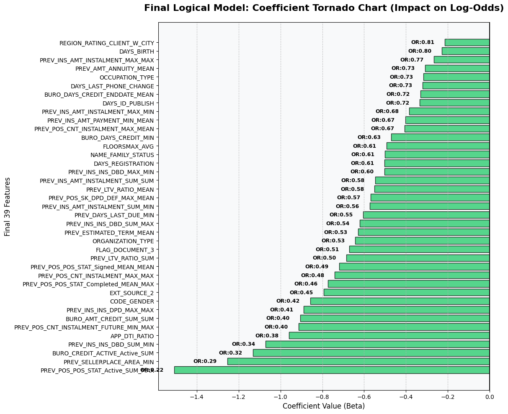
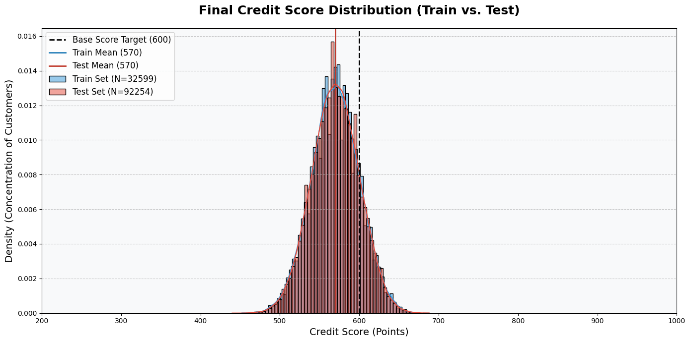
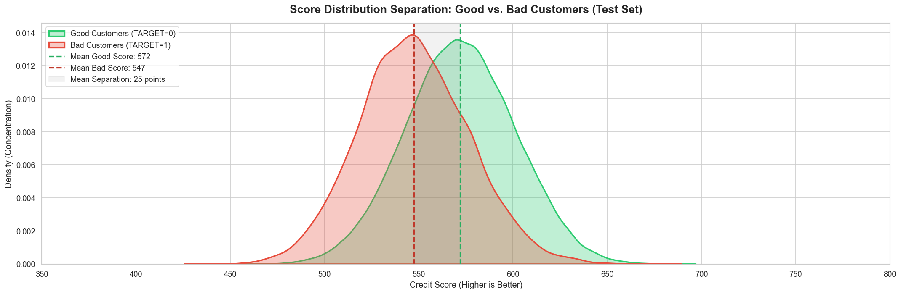
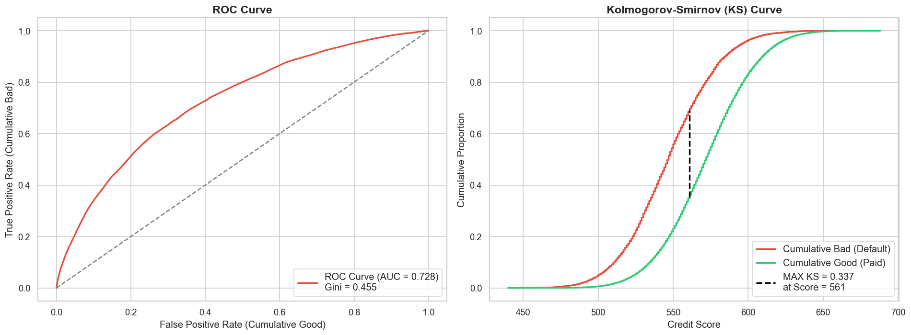
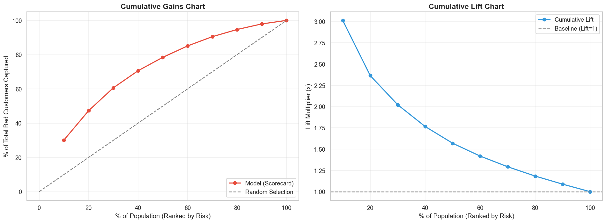
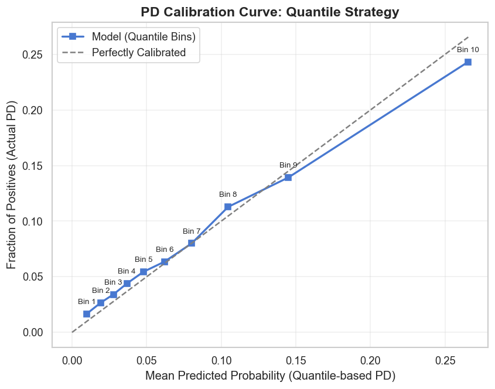
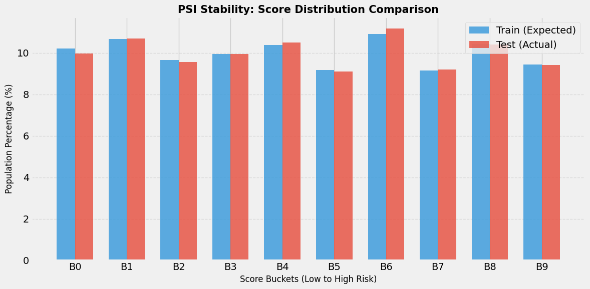
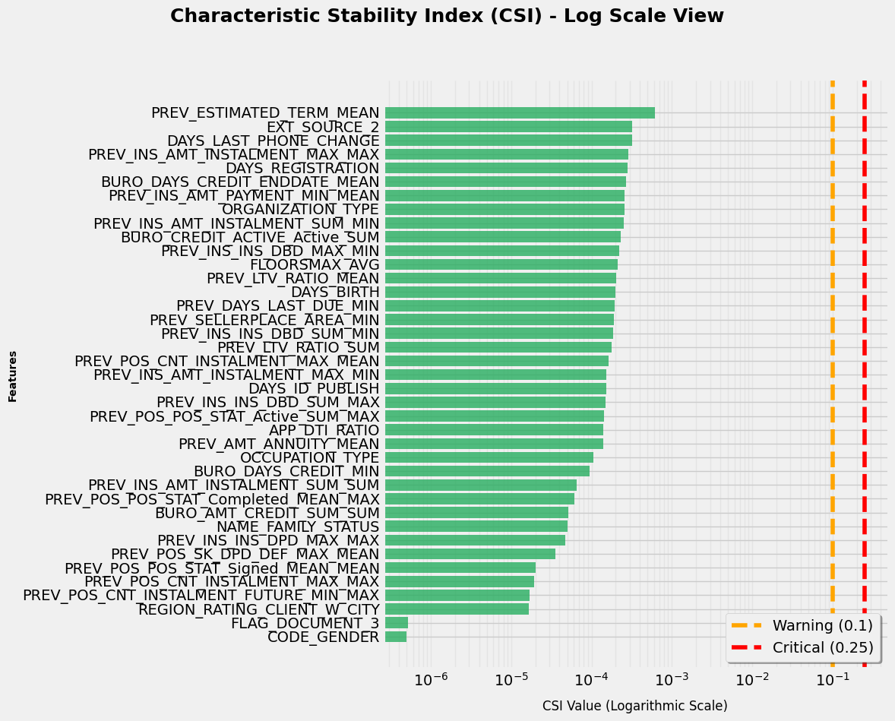

# Professional Credit Risk Scorecard

## 1. Project Overview & Executive Summary

### 1.1. Business Objective
Bu projenin temel amacı, bireysel kredi portföylerinde **Temerrüt Olasılığı'nın (Probability of Default - PD)** makine öğrenmesi ve istatistiksel teknikler kullanılarak yüksek doğrulukla tahmin edilmesidir. Geliştirilen model, finansal kurumların kredi tahsis süreçlerini optimize etmeyi, risk maliyetlerini düşürmeyi ve sermaye yeterliliği standartlarına (Basel kriterleri) uyum sağlamayı hedeflemektedir.

### 1.2. Methodological Adherence
Proje, "Kara Kutu" (Black-box) yapay zeka modelleri yerine, şeffaf ve açıklanabilir bir yapı sunan **Naeem Siddiqi'nin "Intelligent Credit Scoring"** metodolojisini temel almaktadır. Tüm değişken mühendisliği, istatistiksel eleme ve puan ölçeklendirme adımları bu endüstri standardı çerçevesinde inşa edilmiştir.

---

## 2. Methodology

### 2.1. Data Sampling & Splitting Strategy
Analiz, "Home Credit Default Risk" veri setindeki `application_train.csv` dosyası üzerinden gerçekleştirilmiştir. Modelin performansını denetimli bir ortamda (supervised) ölçebilmek adına şu örnekleme stratejisi izlenmiştir:

* **Internal Train-Test Split:** Orijinal Kaggle `application_test.csv` verisinde hedef değişken (`TARGET`) bulunmadığı (yalnızca yarışma gönderimleri için ayrıldığı) için, modelin ayrıştırma gücünü ve kalibrasyonunu test edebilmek amacıyla `application_train.csv` verisi **%70 Eğitim (Train)** ve **%30 Test (Validation)** olarak ikiye bölünmüştür.
* **Stratified Sampling:** Kredi riskindeki "Default" oranının (~%8) her iki veri setinde de korunması, modelin nadir sınıfı (minority class) doğru öğrenmesi ve test setinde gerçek hayatı yansıtması için **Katmanlı Örnekleme (Stratified Sampling)** yöntemi uygulanmıştır.
* **Temporal Constraint & OOT:** Veri setinde açık zaman damgaları (explicit timestamps) yer almadığı için geleneksel **Out-of-Time (OOT)** doğrulama yapılamamıştır. Bu kısıt nedeniyle, modelin istatistiksel tutarlılığını ölçmek adına **Stratified Random Split** en güvenilir metodoloji olarak kabul edilmiştir.

### 2.2. Definition of "Bad"
Hedef değişken (`TARGET`), iş birimi mantığına uygun olarak ikili (binary) bir sınıflandırma problemi olarak tanımlanmıştır:
* **1 (Bad):** Kredi yükümlülüklerini yerine getiremeyen veya temerrüde düşen müşteriler.
* **0 (Good):** Kredi ödemelerini düzenli yapan müşteriler.

### 2.3. Weight of Evidence (WoE) & Information Value (IV)
Değişkenlerin tahmin gücünü ölçmek ve aşırı öğrenmeyi (overfitting) engellemek için WoE ve IV metrikleri kullanılmıştır.
* **Monotonik Gruplama:** Sürekli değişkenler, risk trendini (monotonicity) bozmayacak şekilde gruplandırılmış (binning) ve log-odds tabanlı WoE değerlerine dönüştürülmüştür.
* **İstatistiksel Eleme:** Başlangıçtaki 434 değişkenden, IV değeri 0.02'nin altında (etkisiz) ve 0.50'nin üzerinde (veri sızıntısı şüphesi) olanlar filtrelenmiş; modele en yüksek sinyali veren **185 anlamlı değişken** seçilmiştir.

---

## 3. Data Architecture

### 3.1. Hierarchical Aggregation & Feature Engineering
Veri seti 7 farklı ilişkisel tablodan oluşmaktadır. Müşterinin (SK_ID_CURR) tüm finansal geçmişini tek bir satıra indirgemek için **Bottom-Up (Aşağıdan Yukarıya) Hiyerarşik Agregasyon** stratejisi izlenmiştir:

1. **Seviye 1 (Sözleşme/Aylık Düzey):** `bureau_balance`, `installments_payments`, `POS_CASH_balance` ve `credit_card_balance` tabloları kendi içlerinde sözleşme numaralarına (`SK_ID_BUREAU`, `SK_ID_PREV`) göre gruplanmıştır.
2. **Seviye 2 (Kredi Düzeyi):** 1. seviyeden elde edilen özetler, `bureau` ve `previous_application` tablolarına bağlanarak müşteri bazında (`SK_ID_CURR`) tekilleştirilmiştir.
3. **Dinamik Agregasyon Kuralları:** `aggregation.py` modülü ile veri tiplerine ve sütun isimlerine göre dinamik fonksiyonlar uygulanmıştır:
   * **Parasal Tutarlar ve Oranlar (AMT, RATIO):** `['min', 'max', 'mean', 'sum']`
   * **Gecikme Günleri (DPD):** `['max', 'mean']`
   * **Zaman Çizelgeleri (DAYS, MONTHS):** `['min', 'max', 'mean']`

#### Domain-Specific Risk Features
Modelin ayrıştırma gücünü artırmak amacıyla, ham veri üzerinden sektör standartlarında (Siddiqi/FICO) risk indikatörleri türetilmiştir:

* **Weighted External Source Score:** Dış büro skorları önem derecesine göre ağırlıklandırılmıştır.
  $$APP\_EXT\_SOURCE\_WEIGHTED = \frac{(EXT\_SOURCE\_1 \cdot 2) + (EXT\_SOURCE\_2 \cdot 3) + (EXT\_SOURCE\_3 \cdot 5)}{10}$$
* **LTV (Loan-to-Value) Ratio:** Çekilen kredinin, alınan malın değerine oranı.
  $$LTV\_RATIO = \frac{AMT\_CREDIT}{AMT\_GOODS\_PRICE}$$
* **DTI (Debt-to-Income) Proxy & Disposable Income:** Müşterinin ödeme gücü ve krediden sonra elinde kalan harcanabilir gelir.
  $$APP\_DISPOSABLE\_INCOME = AMT\_INCOME\_TOTAL - AMT\_ANNUITY$$
* **Payment Discipline (Ödeme Disiplini):** Müşterinin taksitlerini vaktinden önce (DBD) veya gecikmeli (DPD) ödeme davranışı ve ödeme oranı.
  $$INS\_DPD = \max(0, DAYS\_ENTRY\_PAYMENT - DAYS\_INSTALMENT)$$
  $$INS\_AMT\_RATIO = \frac{AMT\_PAYMENT}{AMT\_INSTALMENT}$$
* **Credit Card Utilization:** Kredi kartı limit kullanım oranı.
  $$CC\_UTILIZATION = \frac{AMT\_BALANCE}{AMT\_CREDIT\_LIMIT\_ACTUAL}$$

### 3.2. Data Integrity & Quality Checks
Modelleme öncesi veri kalitesini sağlamak için `01_data_integrity_check.ipynb` üzerinden kapsamlı kontroller yapılmıştır.

* **Eksik Veri (Missing Value) Yönetimi:** Eksik veriler, **WoE (Weight of Evidence)** dönüşümü sırasında bağımsız bir risk grubu (Missing Bin) olarak izole edilmiş ve veri sızıntısı/kaybı önlenmiştir.
* **Korelasyon Yoğunluk Analizi:** Türetilen yüzlerce değişkenin hedef değişken (`TARGET`) ile olan Pearson korelasyonları analiz edilmiştir. 
  * Tek değişkenli (univariate) analizlerde `> 0.05` (güçlü pozitif risk) ve `< -0.05` (güçlü negatif risk) korelasyona sahip "Core Sinyaller" tespit edilmiştir.
  * Çoklu doğrusallığı (Multicollinearity) önlemek adına, kendi aralarında yüksek korelasyona sahip olan türetilmiş değişkenler (örn: `AMT_CREDIT` ve `AMT_ANNUITY`) modelleme aşamasında VIF ve IV değerlerine göre filtrelenmiştir.

---

## 4. Feature Selection & Transformation (Data Pre-processing)
Ham verilerin ve türetilen rasyoların modellemeye uygun hale getirilmesi için `02_feature_selection_and_binning.ipynb` üzerinden istatistiksel eleme süreci işletilmiştir. Toplamda 434 değişkenden oluşan başlangıç havuzu, sektör standartlarındaki testlerden geçirilerek yüksek tahmin gücüne sahip 96 "Core Feature"a indirilmiştir.

### 4.1. Information Value (IV) Filtering
Değişkenlerin hedef değişkeni (`TARGET`) açıklama gücünü ölçmek için **Information Value (IV)** analizi yapılmıştır. IV değeri 0.02'den küçük (zayıf/etkisiz) ve 0.50'den büyük (veri sızıntısı şüphesi) olan değişkenler elenerek yalnızca güvenilir **185 prediktör** seçilmiştir.

### 4.2. Weight of Evidence (WoE) & Monotonic Binning
Seçilen 185 değişken **WoE (Weight of Evidence)** dönüşümüne tabi tutulmuştur:
* `OptimalBinning` kütüphanesi kullanılarak sürekli değişkenler istatistiksel bantlara (bin) ayrılmış ve uç değerlerin (outlier) modeli bozması engellenmiştir. Eksik veriler (Missing values) ise ayrı bir bant olarak izole edilmiştir.
* **Monotonisite:** Alt gruplar (bin) arasındaki risk (Bad Rate) geçişlerinin iş mantığına uygun olarak sürekli artan veya azalan bir formatta olması sağlanmıştır.
  $$WoE_i = \ln \left( \frac{Distribution\_of\_Good_i}{Distribution\_of\_Bad_i} \right)$$

### 4.3. Feature Stability Audit (Health Check)
WoE dönüşümü sonrası oluşan bantların kalitesi denetlenmiştir. %95'ten fazla eksik veriye sahip olan, yetersiz banda sahip olan veya tek bir grupta aşırı yığılma (Over-Concentrated) gösteren değişkenler (Critical Features) elenmiş ve geriye **116 "STABLE"** değişken kalmıştır.

### 4.4. Correlation & VIF Analysis
Lojistik Regresyon modelinin katsayı stabilitesini güvence altına almak için son eleme aşaması uygulanmıştır:
* **Korelasyon Filtresi:** Birbiriyle yüksek oranda korele olan (Pearson > 0.80) değişkenlerden, daha düşük IV değerine sahip olanlar (gölge değişkenler) modelden çıkarılmış ve sayı 97'ye düşmüştür.
* **VIF (Variance Inflation Factor):** Çoklu doğrusallığı engellemek adına VIF skoru 5.0'ın üzerinde olan değişkenler (`YEARS_BEGINEXPLUATATION_AVG`) saptanıp elenerek nihai **96 değişkenlik** tutulmuştur.

---

## 5. Model Development & Scorecard Scaling
İstatistiksel eleme süreçlerinden geçen 96 "Core Feature", `03_logistic_regression_scorecard.ipynb` defterinde **Lojistik Regresyon** algoritması ile modellenmiştir. Kara kutu (black-box) algoritmaları yerine Lojistik Regresyon seçilmesinin temel nedeni, şeffaflık ve matematiksel açıklanabilirliktir.

### 5.1. Initial Statistical Modeling (The Full Model)
Model geliştirme süreci, WoE dönüşümü yapılmış 96 değişkenin tamamının bağımsız değişken (X), `TARGET` kolonunun ise bağımlı değişken (y) olarak atanmasıyla başlamıştır. Temerrüt Olasılığı (PD), Statsmodels kütüphanesinin Logit fonksiyonu ile modellenerek "Tam Model" (Full Model) tahminlemesi yapılmıştır.

### 5.2. Statistical Pruning (P-Value Selection)
Tam Model'in özet istatistikleri incelendiğinde, bazı değişkenlerin çoklu etkileşimler sonucunda istatistiksel anlamlılığını yitirdiği tespit edilmiştir. 
* Modelin varyansını (overfitting riskini) düşürmek ve modelin açıklanabilirliğini arttırmak amacıyla **Geriye Doğru Eleme (Backward Elimination)** stratejisi uygulanmıştır.
* P-değeri (p-value) **0.05** sınırının üzerinde olan anlamsız değişkenler iteratif olarak modelden atılmış ve 96 değişkenden **41 değişkene** (Pruned Model) düşürülmüştür.

### 5.3. Logical Consistency & Sign Check (Açıklanabilirlik Filtresi)
Finansal gerçeklikle çelişen katsayıları (Beta) bulabilmek amacıyla 41 değişkenlik modelin katsayıları incelenmiş ve "ters işaretli" (pozitif katsayılı) 2 değişken (`BURO_CREDIT_ACTIVE_Active_MEAN` ve `PREV_LTV_RATIO_MIN`) iş mantığıyla çeliştiği gerekçesiyle modelden çıkarılmıştır. Sonuç olarak; hem istatistiksel olarak anlamlı hem de bankacılık teorisiyle uyumlu (Logical) **39 nihai değişken** tutulmuştur.



### 5.4. Final Model Estimation & Performance Check (Complexity vs. Performance)
Kalan 39 değişken ile nihai Lojistik Regresyon modeli kurulmuştur. 96 değişkenden 39 değişkene düşülmesi, modelin öngörücü gücünde (predictive power) göz ardı edilebilir düzeyde minimal bir metrik düşüşüne sebep olmuş, buna karşın model hafiflemiş ve iş mantığına uygun hale getirilmiştir.

| Model Versiyonu | Değişken Sayısı | Gini (Eğitim) | KS (Eğitim) |
| :--- | :---: | :---: | :---: |
| Full Model (Tam Model) | 96 | 0.5235 | 0.3878 |
| Pruned Model (P-Value Elemeli) | 41 | 0.5163 | 0.3865 |
| Final Logical Model (İş Mantığı Filtreli) | 39 | 0.5139 | 0.3796 |

Değişken sayısında **~%60'lık bir azalmaya (96 $\rightarrow$ 39) rağmen**, modelin ayrıştırma gücünü gösteren Gini katsayısında yalnızca **~0.01**, KS istatistiğinde ise **~0.008** puanlık bir kayıp yaşanmıştır. 

### 5.5. Scorecard Scaling (Log-Odds to Points)
Nihai modelin ürettiği logaritmik oran (log-odds) çıktıları, 3 basamaklı tam sayı skorlarına ölçeklendirilmiştir.

Bu dönüşüm için endüstri standardı olan Siddiqi formülleri kullanılmıştır:
$$Factor = \frac{PDO}{\ln(2)}$$
$$Offset = BaseScore - (Factor \cdot \ln(BaseOdds))$$
$$Score = Offset + Factor \cdot \ln(Odds)$$

**Ölçeklendirme Kalibrasyonu:**
* **Base Score (Temel Puan):** 600
* **Base Odds (Temel Oran):** 1:50 (50 İyi müşteriye karşılık 1 Kötü müşteri)
* **Points to Double Odds (PDO):** 20 (Her 20 puanlık artışta riskin yarı yarıya düşmesi kuralı)

*Hesaplamalar sonucunda modelin **Base Intercept Point (Temel Başlangıç Puanı) 562** olarak belirlenmiş olup, her bir müşteri profiline bu başlangıç puanı üzerinden özelliklerinin (WoE * Katsayı) puan karşılığı kümülatif olarak eklenerek nihai kredi skoru hesaplanmaktadır.*



### 5.6. Artefact Exporting
Geliştirilen modelin raporlama aşamasında kullanılabilmesi için gerekli dökümanlar dışa aktarılmıştır:
* Tahminleme yapan yapay zeka modeli (`final_logical_model.pkl`).
* İş birimlerinin kredi politikalarını belirleyebilmesi için puan kartı tablosu (`scorecard_mapping_39.csv` ve `final_scorecard.xlsx`).
* Sonraki aşamalarda (Teşhis ve Stabilite Testleri) kullanılmak üzere skorlanmış nihai Eğitim ve Test veri setleri.

---

## 6. Performance Metrics & Diagnostics
Kredi risk modelleri sadece skor üretmekle kalmaz; ürettikleri skorların istatistiksel ve finansal gerçekliklerle sınanması gerekir. Projenin `04_model_diagnostics_performance.ipynb` defterinde, modelin tahmin gücünü (predictive power), kalibrasyonunu ve iş birimlerine yönelik risk ayrıştırma yeteneğini test etmek için uçtan uca teşhis (diagnostics) testleri uygulanmıştır.

### 6.1. Data Import & Good/Bad Score Distribution
Eğitim seti dışındaki tamamen görünmeyen (unseen) **Test Seti** içeri aktarılmış ve modelin ürettiği kredi skorlarının (Score) "İyi" (ödeme yapan) ve "Kötü" (temerrüde düşen) müşteriler arasındaki dağılımı incelenmiştir. Puan kartının 440 ile 688 skor bandında mantıksal bir çan eğrisi çizdiği ve "Kötü" müşterilerin düşük skorlarda (sol kuyruk) başarılı bir şekilde yığıldığı gözlemlenmiştir.



### 6.2. Global Discriminatory Power (ROC & KS)
Modelin riskleri ayırt etme yeteneği (Rank Ordering) iki temel makro metrik ile kanıtlanmıştır:
* **Gini Katsayısı (AUC):** Test verisi üzerinde model **0.4550 Gini** (AUC: 0.7275) skoru üretmiştir. Model, istikrarlı bir ayrıştırma gücü sergilemiştir.

* **Kolmogorov-Smirnov (KS) İstatistiği:** İyi ve Kötü müşteri kümülatif dağılımlarının birbirinden maksimum düzeyde uzaklaştığı ölçüdür. Hesaplanan **0.3371 KS İstatistiği**, modelin riski birbirinden net bir sınırla izole edebildiğini göstermektedir. Maksimum ayrışımın yaşandığı **561 Puan**, modelin matematiksel olarak en keskin olduğu optimal noktadır.



### 6.3. Rank Ordering & Decile Analysis
Modelin ürettiği skorlar ondalık dilimlere (Deciles) bölünmüş ve skor düştükçe "Bad Rate"in (Temerrüt Oranının) düzenli olarak artıp artmadığı test edilmiştir. İnceleme sonucunda, risk profilinde "zikzakların" olmadığı, yüksek riskli ilk dilimlerde (Bottom Deciles) kötü müşterilerin başarılı bir şekilde yoğunlaştığı (Concentration) doğrulanmıştır.

| Decile | Skor Aralığı | Toplam Müşteri | Kötü Müşteri (Default) | Temerrüt Oranı (Bad Rate) | Kümülatif Kötü Müşteri (%) | KS İstatistiği | Lift (Katma Değer) |
| :---: | :---: | :---: | :---: | :---: | :---: | :---: | :---: |
| **1** | 440 - 532 | 9.226 | 2.244 | **%24.32** | %30.13 | 21.90 | **3.01x** |
| **2** | 532 - 545 | 9.225 | 1.278 | **%13.85** | %47.29 | 29.68 | **1.72x** |
| **3** | 545 - 554 | 9.225 | 995 | **%10.79** | %60.65 | 33.34 | **1.34x** |
| **4** | 554 - 562 | 9.226 | 743 | **%8.05** | %70.62 | 33.31 | **1.00x** |
| **5** | 562 - 570 | 9.225 | 583 | **%6.32** | %78.45 | 30.95 | **0.78x** |
| **6** | 570 - 578 | 9.225 | 495 | **%5.37** | %85.10 | 27.30 | **0.66x** |
| **7** | 578 - 586 | 9.226 | 402 | **%4.36** | %90.49 | 22.29 | **0.54x** |
| **8** | 586 - 595 | 9.225 | 312 | **%3.38** | %94.68 | 15.97 | **0.42x** |
| **9** | 595 - 609 | 9.225 | 243 | **%2.63** | %97.95 | 8.64 | **0.33x** |
| **10** | 609 - 688 | 9.226 | 153 | **%1.66** | %100.00 | 0.00 | **0.21x** |

*Tablo Analizi: İlk 3 decile (en düşük skorlu %30'luk kesim), portföydeki toplam batıkların (Kümülatif Kötü) **%60.65**'ini tek başına yakalamaktadır. Ayrıca en riskli 1. Decile'deki müşteriler, portföy ortalamasının tam **3.01 katı (Lift)** daha fazla temerrüt eğilimi göstermektedir. Decile ilerledikçe Bad Rate (%24.32 $\rightarrow$ %1.66) düşüş sergilemektedir.*

### 6.4. Cumulative Lift & Gain Charts
Modelin "hedefsiz bir onay stratejisine" kıyasla bankaya sağladığı katma değer (Lift) hesaplanmıştır. Kümülatif Gain analizi ile portföydeki toplam batıkların (Defaults) çok büyük bir kısmının, modelin işaret ettiği düşük skorlu dar bir kesimde yakalandığı (Capture Rate) görselleştirilmiştir.



### 6.5. Cut-off Strategy & Business Decision Matrix
Modelin istatistiksel çıktısı, finansal bir karar mekanizmasına dönüştürülmüştür. Gerçekleştirilen simülasyonlar doğrultusunda banka için en kârlı/güvenli eşik değer (Cut-off) stratejisi belirlenmiştir:
* **Önerilen Kesme Noktası (Cut-off Score): 560 Puan**
* **Beklenen Onay Oranı (Approval Rate):** ~%63.7
* **Hedef Portföy Temerrüt Oranı (Target Bad Rate):** ~%4.17
* **Kötü Müşteri Yakalama Verimliliği (Capture Efficiency):** ~%67.1

*Yorum: Banka, kredi onay eşiğini 560 Puan olarak belirlediğinde; potansiyel temerrütlerin %67.1'ini baştan reddederek portföy kayıp oranını (NPL) güvenli bir sınır olan %4.17'de tutmayı başarabilmektedir.*

### 6.6. PD Calibration Check
Puan kartının ürettiği soyut skorların gerçek hayattaki **Temerrüt Olasılığı (PD)** karşılıkları test edilmiştir:
* **Brier Skoru:** 0.06965
* **Beklenen Kalibrasyon Hatası (ECE):** 0.00647

Brier Skorunun 0'a bu denli yakın olması, modelin "tahmin ettiği oran" ile "gerçekleşen risk oranı" (Expected vs Actual) arasında neredeyse mükemmel bir tutarlılık olduğunu kanıtlar. ECE'nin son derece düşük olması ise modelin kalibrasyonunun (Calibration) Basel III normlarına uygunluğunu tasdik eder.



### 6.7. Score to PD Mapping (Risk Grading)

Siddiqi metodolojisi uyarınca tüm müşteri kitlesi, skorlarına göre 10 farklı risk bandına (Risk Grade) ayrılmıştır. Sektör standartlarına uygun olarak en risksiz müşteriler G1, en riskli müşteriler ise G10 olarak derecelendirilmiştir:

| Risk Grade | Minimum Puan | Maksimum Puan | Müşteri Sayısı | Beklenen Temerrüt Olasılığı (Avg_PD) | Risk Profili |
| :---: | :---: | :---: | :---: | :---: | :--- |
| **G1** | 610 | 688 | 8.700 | **%1.60** | En Düşük Risk (Prime) |
| **G2** | 596 | 609 | 9.612 | **%2.62** | Düşük Risk |
| **G3** | 587 | 595 | 8.488 | **%3.36** | Düşük Risk |
| **G4** | 579 | 586 | 9.050 | **%4.19** | Kabul Edilebilir Risk |
| **G5** | 571 | 578 | 9.649 | **%5.36** | Kabul Edilebilir Risk |
| **G6** | 563 | 570 | 9.695 | **%6.25** | Orta Risk |
| **G7** | 555 | 562 | 9.184 | **%7.94** | Yüksek Risk |
| **G8** | 546 | 554 | 8.819 | **%10.66** | Yüksek Risk |
| **G9** | 533 | 545 | 9.288 | **%13.63** | Çok Yüksek Risk |
| **G10**| 440 | 532 | 9.769 | **%23.90** | En Yüksek Risk (Subprime)|

*Tablo Analizi: Puan kartı 10 dereceli istikrarlı bir merdiven yapısı oluşturmuştur. 610 puanın üzerindeki (G1) müşterilerin ödeyememe ihtimali sadece %1.60 iken, 532 puanın altındaki (G10) kitlenin riski yaklaşık %24'e fırlamaktadır.*

---

## 7. Model Stability & Pipeline Integrity (PSI & CSI)

Kredi risk modelleri normal şartlarda zaman içindeki makroekonomik değişimlere veya portföy kaymalarına (Data Drift) karşı **Zaman Dışı (Out-of-Time / OOT)** test setleriyle doğrulanır. Ancak, bu veri setinde başvurulara ait gerçek zaman damgaları (explicit timestamps) bulunmadığı için geleneksel bir OOT analizi yapılamamıştır. 

Bunun yerine uygulanan **%70 Eğitim / %30 Test (Stratified Random Split)** stratejisinde, PSI ve CSI metrikleri modelin gelecekteki kaymasını ölçmekten ziyade; **veri işleme hattının (Pipeline Integrity), WoE dönüşümlerinin ve örneklem homojenliğinin sızıntısız (Data Leakage olmadan) çalıştığını matematiksel olarak kanıtlamak** amacıyla kullanılmıştır.

### 7.1. Population Stability Index (PSI)
Eğitim setinde (Expected) kurulan puanlama mantığının, tamamen görünmeyen Test setinde (Actual) aynı skor dağılımını üretip üretemediği ölçülmüştür. Bu, veriyi rastgele bölerken istatistiksel bir sapma yaratıp yaratmadığımızın kontrolüdür.

**Matematiksel Formül:**
$$PSI = \sum_{i=1}^{Bins} (Actual\%_i - Expected\%_i) \cdot \ln\left(\frac{Actual\%_i}{Expected\%_i}\right)$$

**PSI değeri 0.0002** olarak ölçülmüştür. 

*Endüstri Standartları:*
* **PSI < 0.10:** Stabil / Değişim Yok (Yeşil Bölge)
* **0.10 $\le$ PSI < 0.25:** Minör Kayma / İzleme Gerekir (Sarı Bölge)
* **PSI $\ge$ 0.25:** Majör Kayma / Yeniden Kalibrasyon Şart (Kırmızı Bölge)

> **Methodological Insight:** Elde edilen 0.0002 değeri, 0.10 olan kırmızı çizginin çok altındadır. Bu durum; 70/30 veri bölme işleminin homojenlik bir şekilde gerçekleştiğini, Eğitim setinde hesaplanan WoE/Kesme noktalarının Test setine uygulanırken veri sızıntısı (Leakage) veya dağılım bozulmasına sebep olmadığını gösterir.



### 7.2. Characteristic Stability Index (CSI / Feature-Level PSI)
Sistem genelindeki PSI düşük olsa bile, alt kırılımlardaki bazı değişkenlerin (features) Test setine aktarılırken dağılımsal hatalara (Örn: Aykırı değerlerin veya NaN verilerin yanlış yönetilmesi) maruz kalıp kalmadığını kontrol etmek için **39 nihai değişkenin her biri için ayrı ayrı CSI** hesaplanmıştır.

Yapılan analizde, **39 değişkenin tamamı "Stable" (PSI < 0.10)** seviyesinde çıkmıştır. Test setinde Eğitim setine kıyasla "en çok dağılım farkı" gösteren Top 5 değişkendeki kayma ihmal edilebilir düzeydedir:

| Feature (Değişken) | PSI Değeri | Durum (Status) |
| :--- | :---: | :---: |
| `PREV_ESTIMATED_TERM_MEAN` | 0.000615 | Stabil |
| `EXT_SOURCE_2` | 0.000322 | Stabil |
| `DAYS_LAST_PHONE_CHANGE` | 0.000318 | Stabil |
| `PREV_INS_AMT_INSTALMENT_MAX_MAX` | 0.000285 | Stabil |
| `DAYS_REGISTRATION` | 0.000280 | Stabil |



---

## 8. Directory Structure
*Not: Orijinal `data/raw/` ve `data/processed/` klasörleri dosya boyutu limitleri nedeniyle GitHub reposuna dahil edilmemiştir. Veri setinin orijinal hali Kaggle "Home Credit Default Risk" yarışmasından temin edilebilir.*

```text
Credit_Risk_Analysis/
├── notebooks/
│   ├── 01_data_integrity_check.ipynb          # Veri kalitesi, EDA ve korelasyon analizleri
│   ├── 02_feature_selection_and_binning.ipynb # IV/WoE dönüşümleri, Monotonic Binning ve VIF analizi
│   ├── 03_logistic_regression_scorecard.ipynb # Model eğitimi, p-value/mantık elemesi ve Scorecard inşası
│   ├── 04_model_diagnostics_performance.ipynb # Gini, KS, Brier metrikleri ve Cut-off (Eşik Değer) stratejisi
│   └── 05_model_monitoring_stability_psi.ipynb# PSI/CSI stabilite testleri ve veri kayması (drift) izleme
├── src/
│   ├── __init__.py
│   ├── preprocessing.py              # Domain spesifik özellik (DTI, LTV vb.) üretimi ve veri dönüşümleri
│   ├── aggregation.py                # Alt tabloları (bureau, previous_application vb.) müşteri seviyesinde birleştirme
│   ├── scorecard_utils.py            # IV, VIF, P-Value eleme (Pruning) ve Log-Odds to Points (Ölçeklendirme) fonksiyonları
│   └── metrics.py                    # Gini, KS, PSI hesaplama, Cut-off simülasyonları ve Diagnostik Görselleştirme araçları
├── outputs/
│   ├── models/                       # .pkl formatında üretime hazır yapay zeka modelleri (`final_logical_model.pkl`)
│   ├── reports/                      # Karar matrisleri, diagnostik grafikler (.png) ve analiz çıktıları
│   └── final_scorecard.xlsx          # Puanlama kurallarının iş birimi (Risk/Tahsis) formatındaki hali
├── requirements.txt                  # Proje bağımlılıkları (pandas, scorecardpy, statsmodels vb.)
└── README.md                         # Proje metodolojisi ve kullanım dökümantasyonu